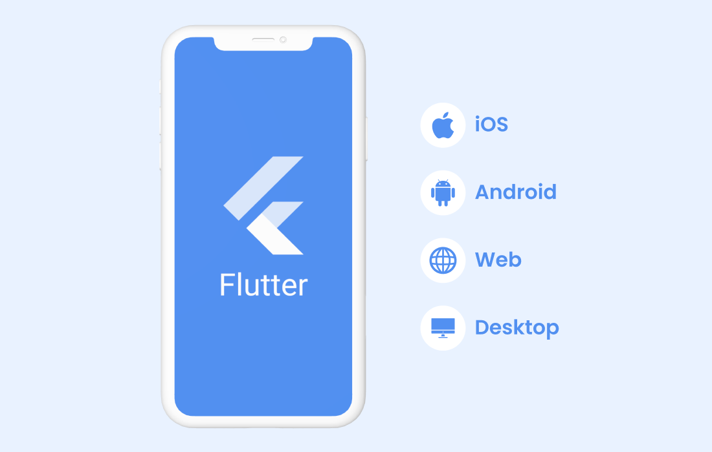

:memo: <span style="color:orange">FLUTTER_006_FUTURE_BUILDER_AND_STREAM_BUILDER</span>

# FUTURE BUILDER VÀ STREAM BUILDER



## Table of Content

- [FUTURE BUILDER VÀ STREAM BUILDER](#future-builder-và-stream-builder)
  - [Table of Content](#table-of-content)
  - [I. Future Builder](#i-future-builder)
  - [II. Stream Builder](#ii-stream-builder)
  - [III. Ứng dụng thực tế](#iii-ứng-dụng-thực-tế)

## I. Future Builder

- `FutureBuilder` được sử dụng khi có một Future (một tác vụ không đồng bộ trả về kết quả một lần, như gọi API hoặc truy vấn cơ sở dữ liệu) và muốn xây dựng giao diện dựa trên trạng thái của tác vụ đó.
- Khi `Future` được thực thi, nó sẽ trả về một trong ba trạng thái: `waiting (chờ đợi)`, `completed (hoàn thành)`, hoặc `error (lỗi)`. FutureBuilder cập nhật giao diện tương ứng.
  - Khi widget được dựng, FutureBuilder sẽ bắt đầu thực thi Future (nếu Future chưa chạy).
  - Nó sẽ xây dựng giao diện tùy vào connectionState và dữ liệu trong snapshot.
  - Sau khi Future hoàn thành, giao diện sẽ được cập nhật một lần dựa trên kết quả của Future.

- **Khi nào dùng FutureBuilder?**
  - Gọi API một lần khi widget được xây dựng.
  - Lấy dữ liệu từ cơ sở dữ liệu hoặc các tác vụ bất đồng bộ chỉ cần thực thi một lần.

```Dart
FutureBuilder<T>(
  future: myFutureFunction(), // Future cần thực thi
  builder: (BuildContext context, AsyncSnapshot<T> snapshot) {
    if (snapshot.connectionState == ConnectionState.waiting) {
      return CircularProgressIndicator(); // Hiển thị khi đang chờ dữ liệu
    } else if (snapshot.hasError) {
      return Text('Error: ${snapshot.error}'); // Hiển thị lỗi nếu có
    } else if (snapshot.hasData) {
      return Text('Data: ${snapshot.data}'); // Hiển thị dữ liệu khi thành công
    } else {
      return Text('No Data');
    }
  },
);
```

```Dart
Future<List<String>> fetchProducts() async {
  await Future.delayed(Duration(seconds: 2)); // Giả lập độ trễ
  return ['Product A', 'Product B', 'Product C']; // Kết quả trả về
}

class FutureBuilderExample extends StatelessWidget {
  @override
  Widget build(BuildContext context) {
    return Scaffold(
      appBar: AppBar(title: Text("FutureBuilder Example")),
      body: FutureBuilder<List<String>>(
        future: fetchProducts(),
        builder: (context, snapshot) {
          if (snapshot.connectionState == ConnectionState.waiting) {
            return Center(child: CircularProgressIndicator());
          } else if (snapshot.hasError) {
            return Center(child: Text('Error: ${snapshot.error}'));
          } else if (snapshot.hasData) {
            final products = snapshot.data!;
            return ListView.builder(
              itemCount: products.length,
              itemBuilder: (context, index) => ListTile(
                title: Text(products[index]),
              ),
            );
          } else {
            return Center(child: Text('No data available'));
          }
        },
      ),
    );
  }
}
```

> FutureBuilder sẽ không tự chạy lại Future trừ khi thay đổi Future được cung cấp.

## II. Stream Builder

- StreamBuilder được sử dụng khi có một Stream (luồng dữ liệu bất đồng bộ có thể thay đổi theo thời gian, như sự kiện thời gian thực hoặc dữ liệu từ Firebase) và muốn cập nhật giao diện bất cứ khi nào dữ liệu trong luồng thay đổi.
- StreamBuilder lắng nghe các sự kiện trong Stream và cập nhật giao diện mỗi khi nhận được dữ liệu mới.

```Dart
StreamBuilder<T>(
  stream: myStreamFunction(), // Stream cần lắng nghe
  builder: (BuildContext context, AsyncSnapshot<T> snapshot) {
    if (snapshot.connectionState == ConnectionState.waiting) {
      return CircularProgressIndicator(); // Hiển thị khi đang chờ dữ liệu
    } else if (snapshot.hasError) {
      return Text('Error: ${snapshot.error}'); // Hiển thị lỗi nếu có
    } else if (snapshot.hasData) {
      return Text('Data: ${snapshot.data}'); // Hiển thị dữ liệu khi nhận được
    } else {
      return Text('No Data');
    }
  },
);
```

- **Khi nào dùng StreamBuilder?**
  - Lắng nghe luồng dữ liệu từ Firebase Realtime Database hoặc Firestore.
  - Các tác vụ mà dữ liệu thay đổi liên tục (e.g., cập nhật giá cổ phiếu, tin nhắn chat theo thời gian thực).

```Dart
Stream<int> countdownStream() async* {
  for (int i = 5; i >= 0; i--) {
    await Future.delayed(Duration(seconds: 1)); // Mô phỏng thời gian thực
    yield i;
  }
}

class StreamBuilderExample extends StatelessWidget {
  @override
  Widget build(BuildContext context) {
    return Scaffold(
      appBar: AppBar(title: Text("StreamBuilder Example")),
      body: StreamBuilder<int>(
        stream: countdownStream(),
        builder: (context, snapshot) {
          if (snapshot.connectionState == ConnectionState.waiting) {
            return Center(child: CircularProgressIndicator());
          } else if (snapshot.connectionState == ConnectionState.done) {
            return Center(child: Text('Countdown Complete!'));
          } else if (snapshot.hasError) {
            return Center(child: Text('Error: ${snapshot.error}'));
          } else if (snapshot.hasData) {
            return Center(
              child: Text(
                'Countdown: ${snapshot.data}',
                style: TextStyle(fontSize: 30),
              ),
            );
          } else {
            return Center(child: Text('No data available'));
          }
        },
      ),
    );
  }
}
```

> StreamBuilder tự động hủy việc lắng nghe Stream khi widget bị hủy.
> Nếu Stream không bao giờ hoàn tất (như luồng sự kiện từ Firebase), StreamBuilder sẽ tiếp tục hoạt động miễn là widget còn tồn tại.

| Tiêu chí           | FutureBuilder                              | StreamBuilder                                      |
| ------------------ | ------------------------------------------ | -------------------------------------------------- |
| Đặc tính dữ liệu   | Dữ liệu bất đồng bộ, trả về một lần.       | Dữ liệu bất đồng bộ, cập nhật liên tục.            |
| Trạng thái dữ liệu | Chỉ có dữ liệu sau khi Future hoàn thành.  | Luôn lắng nghe và cập nhật khi Stream gửi dữ liệu. |
| Hiệu năng          | Tốt cho tác vụ một lần, ít tốn tài nguyên. | Tốn tài nguyên hơn vì lắng nghe liên tục.          |
| Ứng dụng phổ biến  | API gọi một lần, tải dữ liệu ban đầu.      | Firebase, WebSocket, luồng sự kiện thời gian thực. |

## III. Ứng dụng thực tế

- **FutureBuilder:**
  - Gọi API (REST, GraphQL) để lấy dữ liệu một lần.
  - Tải dữ liệu từ cơ sở dữ liệu SQLite/local database.
- **StreamBuilder:**
  - Hiển thị dữ liệu thời gian thực từ Firebase Realtime Database hoặc Firestore.
  - Lắng nghe các thay đổi trạng thái kết nối (WebSocket, SignalR).
  - Cập nhật giao diện theo thời gian thực (e.g., thông báo trong ứng dụng chat).
- **Tối ưu hóa**
  - Với FutureBuilder, tránh gọi lại Future không cần thiết bằng cách lưu trữ Future trong biến initState hoặc ViewModel.
  - Với StreamBuilder, đảm bảo Stream không gây rò rỉ bộ nhớ bằng cách đóng Stream hoặc sử dụng StreamController một cách hợp lý.
